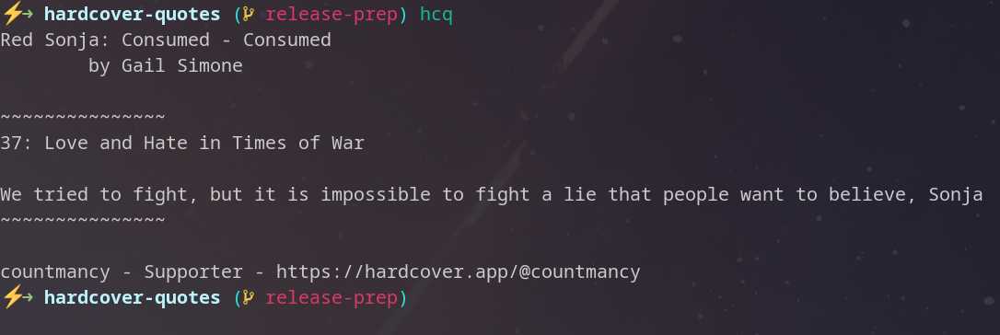
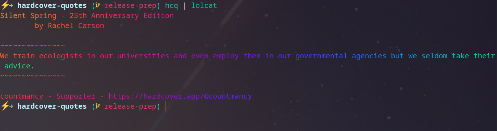

# Hardcover Quotes - HCQ
Go program to fetch a random quote from your [hardcover.app](https://hardcover.app/join?referrer_id=28377) reading journals and output it to your terminal (think message of the day or on initial shell invocation).


ps. add me on hardcover 🤓 [https://hardcover.app/@countmancy](https://hardcover.app/@countmancy?referrer_id=28377)


WARNING: the hardcover api is still under development and might have changes that break this project.
[please review the api access page for more information](https://hardcover.app/account/api)


# Requirements
- hardcover.app api key stored in the env var `HARDCOVER_API_TOKEN`
  - Token can be grabbed from [hardcover.app/account/api](https://hardcover.app/account/api)

# Installation
 Grab the [latest binary release](https://github.com/GianniBYoung/hardcover-quotes/releases/latest) or install via `go`:

`go install github.com/GianniBYoung/hardcover-quotes/cmd/hcq@latest`

# Usage and Applications
- `hcq` will output a formatted string to `stdout`
- A webhook will be sent if the env var `HCQ_WEBHOOK_URL` is set



- Pipe it to `lolcat` or `cowsay` for more fun!
- Set the MOTD(message of the day)
- Print a quote upon shell invocation!
- Send a webhook to a service such as [trml for displaying the quote on an e-ink display!](https://usetrmnl.com)
  - note, the link above contains my referral code if you decide to purchase a trml device

```bash
[[ $SHLVL -le 1 ]] && hcq
```



# Configuration Options
## Environmental Variables
- `HARDCOVER_API_TOKEN` -> required to set be able to access your profile and retrieve quotes
- `HCQ_WEBHOOK_URL` -> If set, will send a POST request to the specified URL with the quote
- `HCQ_INFO_LEVEL` -> increase the verbosity for debugging
  - `debug`
  - `info`
  - `warning`

# Inspiration
Links to some projects that inspired me to start this project, check them out!

- [koblime - exporting highlights from kobo devices](https://kobli.me)
  - This program is pretty cool and helps keep track of highlights but offers little in the way of syncing to other platforms at the moment

- [Spotify Recently Played README](https://github.com/JeffreyCA/spotify-recently-played-readme)
  - Eventually I want to hook something up to my github profile to dynamically update it with a quote generated from HCQ

# Contributing
Contributions appreciated!

Take a look at the issues, submit feature requests, submit Pull requests etc
